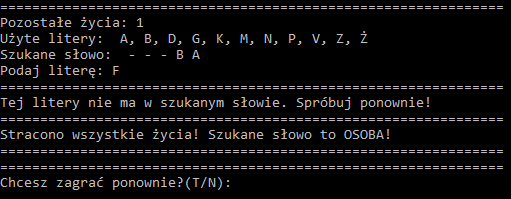

# Hangman
> This application enables to play hangman game in english or polish language.

## Table of contents
* [General info](#general-info)
* [Screenshots](#screenshots)
* [Technologies](#technologies)
* [Setup](#setup)
* [Features](#features)
* [Status](#status)
* [Contact](#contact)

## General info
I made this application for fun and to train my skills in Python functionalities. This game is fully playable in two languages - english and polish including specific polish chars. 
There are about 3000 english words and 1000 polish words to discover. Application reads chosen words list from .txt file and randomizes the word to guess. User needs to type char, that is in hidden word. If user chooses the wrong letter, he will lose one of his lives. The game ends when the user guesses all the letters or loses all lives.

## Screenshots
### English Version

### Polish Version

## Technologies
* Python 3.8.1
* random
* string

## Setup
To run Hangman you will need to: 
* clone this repository to your computer or unpack .7z file in chosen directory
* run comand line
* type "python X:\Hangman_directory\main.py"
After those steps the game is ready to play.

## Features
* Two languages available (polish and english)
* 3000 english and 1000 polish words available

## Status
The project is ready for use, requires minor improvements.

## Contact
Created by [@matedawid](https://linkedin.com/in/matedawid) - if you have any questions, just contact me!
